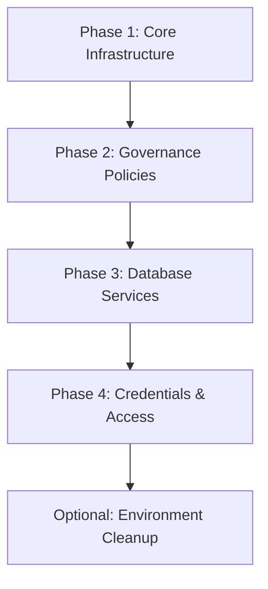

# Demo Platform Deployment Guide 🚀

> **For Learning Engineers**: This is your comprehensive guide to understanding and deploying the complete Demo AI Platform infrastructure. Start here to learn about modern cloud architecture and Infrastructure as Code!

## 🎯 What You'll Learn

- Complete enterprise platform deployment patterns
- How microservices communicate in the cloud
- Network architecture and security in Azure
- Production-grade DevOps practices
- Troubleshooting complex distributed systems

## 📋 Platform Overview

The Demo Platform is a complete AI-powered application infrastructure that includes:

- **🧠 AI Services**: OpenAI, Form Recognition, Machine Learning
- **�️ Database**: Cosmos DB for scalable data storage
- **🔒 Security**: Key Vault, Managed Identities, Policy Governance
- **📊 Observability**: Monitoring, Logging, Application Insights
- **🏛️ Governance**: Policy enforcement and compliance standards

### 🆕 Enterprise Messaging Capabilities

The platform includes production-ready messaging:

- **Azure Service Bus**: Enterprise-grade message queues and topics for reliable async communication
- **Azure Web PubSub**: Real-time WebSocket connections for live updates and notifications

**Learning Tip**: These services enable your applications to communicate reliably even when components are deployed across different regions or availability zones.

---

## 📁 Directory Structure

```text
deployment/
├── README.md                       # This deployment guide
├── ai-platform/                    # AI service deployment automation
│   ├── README.md                   # AI platform deployment guide
│   ├── 1-deploy-ai.sh              # Core AI services deployment
│   ├── 2-deploy-governance.sh      # Governance policies deployment
│   ├── 3-deploy-cosmos-db.sh       # Cosmos DB deployment
│   ├── 3-deploy-cosmos-db.md       # Cosmos DB deployment guide
│   ├── _ai_creds.sh                # AI credentials extraction utility
│   └── _get-acr-creds.sh           # ACR credentials utility
└── env-death/                      # Environment cleanup utilities
    └── kill.sh                     # Complete environment teardown
```

---

## 🚀 AI Platform Deployment

**For Junior Engineers**: This deployment creates a complete AI platform infrastructure on Azure. Think of it as building the foundation and core services for an AI-powered application.

### 🏗️ Deployment Architecture



### Phase 1: Core AI Infrastructure 🧠

```bash
# Navigate to the AI platform directory
cd ai-platform
./1-deploy-ai.sh
```

**What happens here:**

- Creates Azure resource groups (organized containers for your resources)
- Deploys Azure OpenAI services (GPT models for AI processing)
- Sets up Form Recognizer (document processing AI)
- Configures monitoring and logging (Application Insights, Log Analytics)
- Creates Azure Container Registry (for storing container images)

**⏱️ Time**: ~10-15 minutes  
**Why first**: These are the foundation services that everything else depends on

### Phase 2: Governance & Compliance 🏛️

```bash
./2-deploy-governance.sh
```

**What happens here:**

- Deploys Azure Policy definitions for resource tagging
- Creates policy assignments at subscription level
- Enforces compliance standards across all resources
- Sets up governance rules for cost tracking and ownership

**⏱️ Time**: ~3-5 minutes  
**Learning Note**: Governance policies ensure all resources follow organizational standards

### Phase 3: Database Services 🗄️

```bash
./3-deploy-cosmos-db.sh
```

**What happens here:**

- Creates Azure Cosmos DB account (globally distributed NoSQL database)
- Sets up database containers with proper indexing
- Configures access policies and connection strings
- Enables multi-region replication for high availability

**⏱️ Time**: ~5-10 minutes  
**Why important**: Provides scalable data storage for AI applications

### Phase 4: Access & Credentials 🔑

```bash
# Extract AI service credentials for application configuration
./_ai_creds.sh

# Get container registry access (if needed)
./_get-acr-creds.sh
```

**What happens here:**

- Retrieves API keys and endpoints for OpenAI services
- Gets Form Recognizer connection details
- Extracts Azure Container Registry credentials
- Displays configuration values for application setup

**⏱️ Time**: ~2-3 minutes  
**Security Note**: Handle these credentials securely - never commit them to source control!

### Phase 5: Environment Cleanup 🧹 (Optional)

```bash
# Navigate to cleanup utilities
cd ../env-death
./kill.sh
```

**What happens here:**

- **⚠️ WARNING**: Completely destroys the entire environment
- Deletes all resource groups and their contents
- Removes policy assignments and definitions
- **Use only in development/testing scenarios**

**⏱️ Time**: ~5-10 minutes  
**Critical Warning**: This action is irreversible!

---

## �️ Prerequisites & Setup

**For Junior Engineers**: Think of this as your toolbox - you need the right tools before you can build anything!

### Required Tools & Installation

#### 1. Azure CLI 🔵

```bash
# Install on macOS
brew install azure-cli

# Install on Windows (PowerShell as Administrator)
Invoke-WebRequest -Uri https://aka.ms/installazurecliwindows -OutFile .\AzureCLI.msi; Start-Process msiexec.exe -Wait -ArgumentList '/I AzureCLI.msi /quiet'

# Verify installation
az --version
az login
```

#### 2. Azure Bicep CLI 🔷

```bash
# Install latest version
az bicep install

# Verify installation
az bicep version
```

### Azure Permissions Required 🔐

**Understanding Azure RBAC**: Azure uses Role-Based Access Control. You need these specific roles for AI platform deployment:

| Resource Type | Required Role | Why You Need It |
|---------------|---------------|-----------------|
| **Resource Groups** | Contributor | Create and manage all platform resources |
| **Cognitive Services** | Contributor | Deploy OpenAI and Form Recognizer |
| **Cosmos DB** | Contributor | Create and configure database services |
| **Container Registry** | Contributor | Manage container image storage |
| **Policy Definitions** | Resource Policy Contributor | Deploy governance policies |
| **Monitoring** | Contributor | Set up Application Insights and Log Analytics |

**Getting Permissions**: Ask your Azure administrator to grant these roles to your account.

### Pre-Flight Checklist ✅

Run these commands to verify everything is ready:

```bash
# 1. Check Azure authentication
az account show
# Should show your subscription details

# 2. Verify Bicep installation
az bicep version
# Should show version information

# 3. Check subscription permissions
az role assignment list --assignee $(az account show --query user.name -o tsv) --all
# Should list your role assignments

# 4. Verify resource group access
az group list --output table
# Should list your accessible resource groups

# 5. Test policy permissions (important for governance deployment)
az policy definition list --query "[0]" --output table
# Should show policy definitions if you have read access
```

### Environment Setup 🔧

**Important**: Set up your shell environment for consistent deployments:

```bash
# Add to your ~/.bashrc or ~/.zshrc
export AZURE_SUBSCRIPTION_ID="your-subscription-id"
export RESOURCE_GROUP_PREFIX="your-company-prefix"

# Reload your shell
source ~/.bashrc  # or source ~/.zshrc
```

---

## � Troubleshooting Guide

**Learning Mindset**: Every error is a learning opportunity! These are the most common issues and how to solve them step by step.

### Issue 1: Azure AI Services Problems 🧠

**Symptoms**: Can't access OpenAI or Form Recognizer, authentication failures, quota errors

**Diagnostic Steps**:

```bash
# Step 1: Check if AI services are deployed
az cognitiveservices account list --resource-group <ai-rg-name>
# Should show OpenAI and FormRecognizer accounts

# Step 2: Verify service status
az cognitiveservices account show --name <openai-name> --resource-group <rg>
# Look for "provisioningState": "Succeeded"

# Step 3: Check quota and limits
az cognitiveservices usage list --resource-group <rg>
# Look for quota utilization
```

**Common Fixes**:

```bash
# Fix 1: Redeploy AI services
cd ai-platform
./1-deploy-ai.sh

# Fix 2: Check API keys
./_ai_creds.sh
# Verify keys are generated correctly

# Fix 3: Verify resource group and location
az group show --name <ai-rg-name>
# Ensure resource group exists in correct region
```

### Issue 2: Cosmos DB Connection Failures 🗄️

**Symptoms**: Database connection errors, authentication failures, timeout issues

**Understanding**: Cosmos DB is your application's data storage - if it's not accessible, your applications can't save or retrieve data!

**Diagnostic Steps**:

```bash
# Step 1: Check if Cosmos DB account exists
az cosmosdb show --name <cosmos-account-name> --resource-group <platform-rg>
# Should return account details

# Step 2: Verify database and containers
az cosmosdb sql database list --account-name <cosmos-account> --resource-group <rg>
# Should show your databases

# Step 3: Test connectivity
az cosmosdb keys list --name <cosmos-account> --resource-group <rg>
# Should return primary and secondary keys
```

**Common Fixes**:

```bash
# Fix 1: Redeploy Cosmos DB
cd ai-platform
./3-deploy-cosmos-db.sh

# Fix 2: Check connection strings
az cosmosdb keys list --name <cosmos-account> --resource-group <rg> --type connection-strings
# Get updated connection strings

# Fix 3: Verify firewall settings
az cosmosdb show --name <cosmos-account> --resource-group <rg> --query ipRules
# Check IP access rules
```

### Issue 3: Resource Deployment Failures 🔌

**Symptoms**: Deployment errors, resource creation failures, configuration issues

**Learning Note**: Azure has many resource dependencies - permissions, quotas, regional availability. Any one can cause deployment issues!

**Diagnostic Steps**:

```bash
# Step 1: Check deployment status
az deployment group list --resource-group <rg-name> --query '[0].properties.provisioningState'
# Should show "Succeeded"

# Step 2: Get detailed deployment information
az deployment group show --resource-group <rg> --name <deployment-name>
# Look at error messages in the output

# Step 3: Check resource provider registration
az provider show --namespace Microsoft.CognitiveServices --query registrationState
# Should show "Registered"
```

**Common Fixes by Error Type**:

**QuotaExceeded**:

```bash
# Check current usage
az vm list-usage --location <region> --output table

# Request quota increase or use different region
az account list-locations --output table
```

**InsufficientPermissions**:

```bash
# Check your role assignments
az role assignment list --assignee $(az account show --query user.name -o tsv)

# Verify required permissions with admin
echo "Need Contributor role on subscription or resource groups"
```

### Issue 4: Permission & Authentication Errors 🔐

**Symptoms**: "Forbidden", "Unauthorized", "Access denied" messages

**Understanding**: Azure has layers of security - subscription, resource group, and resource level permissions.

**Diagnostic Steps**:

```bash
# Check your current Azure context
az account show

# Verify resource group access
az group show --name <platform-rg-name>

# Check specific resource permissions
az role assignment list --assignee $(az account show --query user.name -o tsv) --resource-group <rg-name>
```

**Common Fixes**:

```bash
# Fix 1: Ensure correct subscription
az account set --subscription "your-subscription-name"

# Fix 2: Verify service principal permissions (if using one)
az ad sp show --id $(az account show --query user.name -o tsv)

# Fix 3: Check resource provider registrations
az provider register --namespace Microsoft.CognitiveServices
az provider register --namespace Microsoft.DocumentDB
```

### 🆘 Emergency Procedures

#### Complete Platform Reset

```bash
# ⚠️ WARNING: This deletes everything!
# Only use in development environments

# 1. Use the cleanup script
cd env-death
./kill.sh

# 2. Manual cleanup if script fails
az group delete --name <ai-rg-name> --yes --no-wait
az group delete --name <platform-rg-name> --yes --no-wait
az group delete --name <monitoring-rg-name> --yes --no-wait

# 3. Remove policy assignments
az policy assignment delete --name "demno-required-tags-assignment"

# 4. Start fresh
# Follow deployment phases 1-5 again
```

#### Quick Health Check

```bash
#!/bin/bash
# Save this as health-check.sh

echo "🏥 AI Platform Health Check"
echo "=========================="

# Check Azure login
az account show > /dev/null 2>&1
if [ $? -eq 0 ]; then
    echo "✅ Azure CLI: Authenticated"
else
    echo "❌ Azure CLI: Not logged in (run 'az login')"
fi

# Check AI services
RG_AI=$(az group list --query "[?contains(name, 'ai-rg')].name" -o tsv)
if [ ! -z "$RG_AI" ]; then
    echo "✅ AI Resource Group: $RG_AI"
    
    # Check OpenAI service
    OPENAI_COUNT=$(az cognitiveservices account list -g "$RG_AI" --query "[?kind=='OpenAI']" --output tsv | wc -l)
    if [ $OPENAI_COUNT -gt 0 ]; then
        echo "✅ Azure OpenAI: Deployed"
    else
        echo "❌ Azure OpenAI: Not found"
    fi
    
    # Check Form Recognizer
    FORMS_COUNT=$(az cognitiveservices account list -g "$RG_AI" --query "[?kind=='FormRecognizer']" --output tsv | wc -l)
    if [ $FORMS_COUNT -gt 0 ]; then
        echo "✅ Form Recognizer: Deployed"
    else
        echo "❌ Form Recognizer: Not found"
    fi
else
    echo "❌ AI Resource Group: Not found"
fi

# Check Cosmos DB
RG_PLATFORM=$(az group list --query "[?contains(name, 'platform-rg')].name" -o tsv)
if [ ! -z "$RG_PLATFORM" ]; then
    COSMOS_COUNT=$(az cosmosdb list -g "$RG_PLATFORM" --output tsv | wc -l)
    if [ $COSMOS_COUNT -gt 0 ]; then
        echo "✅ Cosmos DB: Deployed"
    else
        echo "❌ Cosmos DB: Not found"
    fi
fi

# Check governance policies
POLICY_COUNT=$(az policy assignment list --query "[?contains(name, 'echelix') || contains(name, 'required-tags')]" --output tsv | wc -l)
if [ $POLICY_COUNT -gt 0 ]; then
    echo "✅ Governance Policies: Applied"
else
    echo "❌ Governance Policies: Not found"
fi

echo "=========================="
echo "Run deployment scripts for any ❌ items"
```

---

## 🔗 Related Documentation

### Core Infrastructure

- [Main Infrastructure Guide](../README.md) - Overview of all Bicep templates
- [AI Platform Deployment Guide](ai-platform/README.md) - Detailed deployment instructions
- [Cosmos DB Setup Guide](ai-platform/3-deploy-cosmos-db.md) - Database configuration
- [Platform Overview](../../README.md) - Complete platform architecture

### Bicep Templates & Modules

- [Base Templates](../base-*.bicep) - Infrastructure component definitions
- [Governance Modules](../modules/governance/) - Policy and compliance templates
- [AI Service Modules](../modules/ai/) - OpenAI and Cognitive Services
- [Database Modules](../modules/database/) - Cosmos DB configurations

---

## 🔧 Component Details

### AI Platform Services

Complete AI infrastructure deployment automation

- **Purpose**: Deploy Azure OpenAI, Form Recognizer, and supporting services
- **Features**: Automated resource group creation, service configuration, monitoring setup
- **Security**: Managed identities, Key Vault integration, governance policies
- **Monitoring**: Application Insights, Log Analytics workspace integration

**Key Components:**

- 🧠 **Azure OpenAI**: GPT models for text generation and processing
- 📄 **Form Recognizer**: Document analysis and data extraction
- 📊 **Application Insights**: Performance monitoring and analytics
- 🔍 **Log Analytics**: Centralized logging and query capabilities

### Governance & Compliance

Azure Policy-based governance framework

- **Purpose**: Enforce organizational standards and compliance requirements
- **Features**: Resource tagging policies, compliance monitoring, audit trails
- **Scope**: Subscription-level policy assignments with resource-type filtering
- **Flexibility**: Audit mode for testing, Deny mode for enforcement

**Policy Areas:**

- 🏷️ **Required Tags**: Environment, business unit, cost center, owner identification
- 📋 **Resource Standards**: Naming conventions and configuration baselines
- 🔒 **Security Policies**: Access controls and encryption requirements

### Database Services

Azure Cosmos DB for scalable data storage

- **Purpose**: Provide globally distributed, multi-model database services
- **Features**: Auto-scaling, multi-region replication, multiple consistency levels
- **Integration**: Seamless connectivity with AI services and applications
- **Performance**: Single-digit millisecond latency, automatic indexing

**Capabilities:**

- 🌍 **Global Distribution**: Multi-region deployment with automatic failover
- 📈 **Auto-scaling**: Request unit (RU) scaling based on demand
- 🔄 **Multi-API Support**: SQL API, MongoDB API, Cassandra API compatibility

### Utility Scripts

Helper scripts for credential management and environment cleanup

- **AI Credentials**: Extract service endpoints and API keys for application configuration
- **Registry Access**: Obtain Azure Container Registry authentication details  
- **Environment Cleanup**: Complete resource deletion for development scenarios

**Security Note**: These utilities handle sensitive information - use appropriate security practices

## 🎓 Learning Outcomes for Junior Engineers

After completing this deployment guide, you'll understand:

### Technical Concepts

- ✅ **Infrastructure as Code**: How to define infrastructure in code rather than manual processes
- ✅ **Microservices Architecture**: How applications are broken into small, independent services  
- ✅ **Container Orchestration**: How Kubernetes manages containerized applications at scale
- ✅ **Network Security**: How private networks, DNS, and ingress controllers work together
- ✅ **DevOps Practices**: How automated deployments enable reliable software delivery

### Platform Architecture

- ✅ **Service Discovery**: How applications find and communicate with each other
- ✅ **Load Balancing**: How traffic is distributed across multiple application instances
- ✅ **Security Models**: How managed identities and RBAC protect cloud resources
- ✅ **Observability**: How monitoring and logging provide visibility into system behavior

### Professional Skills

- ✅ **Troubleshooting**: Systematic approaches to diagnosing and fixing issues
- ✅ **Documentation**: How to maintain clear, helpful technical documentation
- ✅ **Automation**: Writing scripts that eliminate manual, error-prone processes

## 🏆 Advanced Learning Path

### Next Steps for Growth

1. **Study the Bicep Templates**: Examine how infrastructure is defined in `../modules/`
2. **Explore Kubernetes Manifests**: Understand how applications are deployed
3. **Practice Troubleshooting**: Intentionally break things in a dev environment to learn
4. **Contribute Improvements**: Suggest enhancements to deployment processes

### Recommended Learning Resources

- 📚 [Azure Architecture Center](https://docs.microsoft.com/en-us/azure/architecture/)
- 📚 [Kubernetes Documentation](https://kubernetes.io/docs/)
- 📚 [CNCF Landscape](https://landscape.cncf.io/) - Cloud Native ecosystem overview
- 📚 [12-Factor App Methodology](https://12factor.net/) - Best practices for cloud applications

## 🛡️ Production Readiness Features

This platform implements enterprise-grade patterns:

- **🔒 Security-First Design**: Private networks, managed identities, zero-trust principles
- **📊 Comprehensive Monitoring**: Full observability with metrics, logs, and tracing
- **🚀 Automated Deployment**: Reproducible, version-controlled infrastructure
- **🔄 High Availability**: Multi-zone deployment with automatic failover
- **📈 Scalability**: Auto-scaling based on demand and resource utilization

## 🆘 Getting Help

### When You're Stuck

1. **Read the Error Messages**: They usually contain the solution
2. **Check the Logs**: Most issues leave traces in application or system logs
3. **Consult Documentation**: Each component has detailed README files
4. **Ask Questions**: No question is too basic when you're learning

### Community Resources

- **Stack Overflow**: Tag questions with `azure`, `kubernetes`, or specific service names
- **GitHub Issues**: Check the official repositories for known issues and solutions
- **Azure Documentation**: Comprehensive guides and tutorials
- **Azure Support**: Professional support options for production issues

---

## 🎉 Congratulations

If you've successfully deployed this platform, you've just accomplished something significant:

- **Deployed enterprise-grade infrastructure** using modern cloud practices
- **Learned industry-standard tools** that are used by top technology companies
- **Gained hands-on experience** with complex distributed systems
- **Built a foundation** for advanced cloud engineering skills

**Remember**: Every expert was once a beginner. The complexity you see today will become intuitive with practice and experience. Keep learning, keep experimenting, and don't be afraid to break things in development environments - that's how you truly learn!

---

## Support

- **Maintained by:** Echelix Engineering Team  
- **Last Updated:** December 2025
- **Version:** 0.1.0 - Enhanced for Learning Engineers
